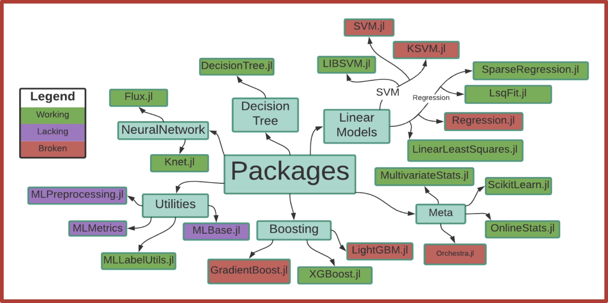

## MLJ Machine Learning Models Tuning Library - 100% Made in Julia

Edoardo Barp, Anthony Blaom, Gergö Bohner, Valentin Churvay, Harvey Devereux, Thibaut Lienart, Franz J Király, Mohammed Nook, Annika Stechemesser, Sebastian Vollmer; Mike Innes in partnership with Julia Computing

The current master branch is under considerable redevelopment. For an
earlier proof-of-concept, see
[this](https://github.com/alan-turing-institute/MLJ.jl/tree/poc)
branch and **this summary [POSTER](material/MLJ-JuliaCon2018-poster.pdf)**



### Requirements

Julia 0.7


### Installation

To install, open Julia, open the package manager (with `]`) and run

````julia
(v0.7) pkg> add https://github.com/alan-turing-institute/MLJ.jl/tree/master
````

Or add MLJ to your current Julia project by first activating your
Project.toml file. Developers, clone the repository and `dev` your
local clone. Test with `test MLJ` at the package manager prompt. 


### Usage

````julia
using MLJ
````

### History

Predecessors of the current package are
[AnalyticalEngine.jl](https://github.com/tlienart/AnalyticalEngine.jl)
and [Orchestra.jl](https://github.com/svs14/Orchestra.jl). Work
continued as a research study group at the Univeristy of Warwick,
beginning with a review of existing ML Modules that are available in
Julia
[in-depth](https://github.com/dominusmi/Julia-Machine-Learning-Review/tree/master/Educational)
and
[overview](https://github.com/dominusmi/Julia-Machine-Learning-Review/tree/master/Package%20Review).

Further work culminated in the first MLJ
[proof-of-concept](https://github.com/alan-turing-institute/MLJ.jl/tree/poc)

MLJ is an attempt to create a framework capable of easily tuning
machine learning models.  Thanks to a solid abstraction layer, it
allows user to easily add new models to its framework, without losing
any of the features.

We are not trying to __reinvent the wheel__ instead we are heavily
inspired by [mlR](https://pat-s.github.io/mlr/index.html) ( [recent
slides 7/18](https://github.com/mlr-org/mlr-outreach). )


## join!(us)
We are looking for collaborators @ the Alan Turing Institute! 
 * Finalising API design and user interaction patterns! 
 * Backend improvement! (Scheduling, Dagger, JuliaDB, Queryverse)
   * Store learner meta info in METADATA.JL fashion (ideally open.ml compatible)
 * Feature Improvement 
   * Bootstrapping from Sklearn and mlr by wrapping with task info
   * Pipelining an composition meta-interface
   * Implementation of unsupported learners


### Proof of concept landmarks:

- [x] Implement first basic structure
- [x] Implement tuning for continuous parameters
- [x] Implement tuning for discrete parameters
- [x] Basic custom sampling method (K-fold)
- [x] Basic CV with custom score
- [x] Wrap at least a handful of models for regression & classification
- [x] Add multivariable regression methods
- [x] Add automatic labelling for classifiers
- [ ] Find a way to make it clear what arguments a model expects
- [ ] Allow any sampling methods from `MLBase.jl`
- [ ] Add compatibility with multiple targets
- [ ] move to more dispatch based system as outlined [HERE](https://nbviewer.jupyter.org/github/gbohner/Julia-Machine-Learning-Review/blob/f3482badf1f275e2a98bf7e338d406d399609f37/MLR/TuningDispatch_framework.ipynb)
- [ ] Upgrade it to Julia 1.0 [issue #4](https://github.com/alan-turing-institute/MLJ/issues/4)


