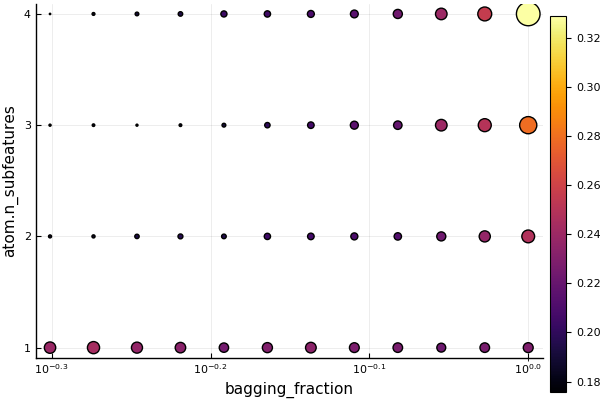
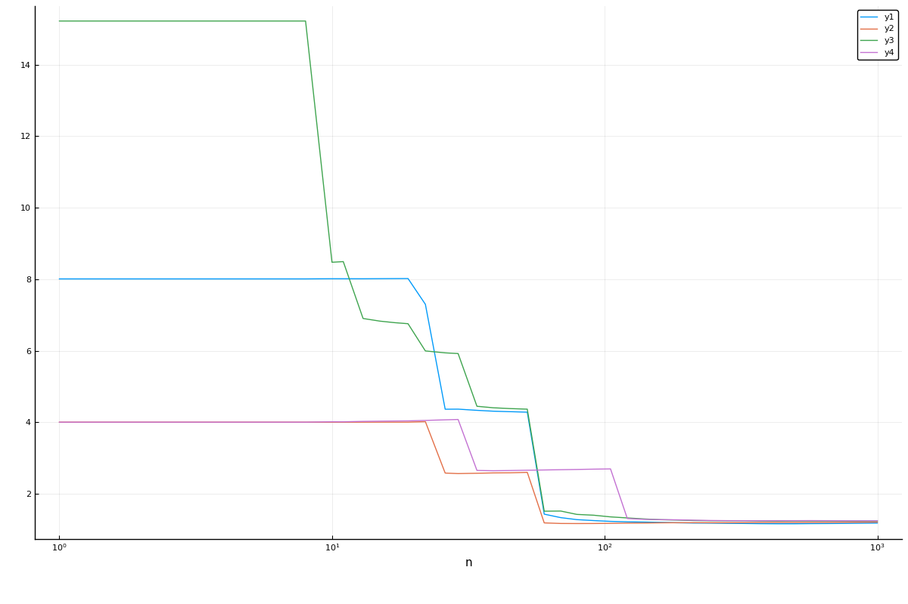

# Common MLJ Workflows

## Data ingestion

```@example workflows
using MLJ; color_off() #hide
using RDatasets
channing = dataset("boot", "channing")
first(channing, 4)
```

Inspecting metadata, including column scientific types:

```@example workflows
schema(channing)
```

Unpacking data and correcting for wrong scitypes:

```@example workflows
y, X =  unpack(channing,
               ==(:Exit),            # y is the :Exit column
               !=(:Time);            # X is the rest, except :Time
               :Exit=>Continuous,
               :Entry=>Continuous,
               :Cens=>Multiclass)
first(X, 4) 
```

*Note:* Before julia 1.2, replace `!=(:Time)` with `col -> col != :Time`. 

```@example workflows
y[1:4]
```

Loading a built-in supervised dataset:

```@example workflows
X, y = @load_iris;
selectrows(X, 1:4) # selectrows works for any Tables.jl table
```

```@example workflows
y[1:4]
```

## Model search (**experimental**)

*Reference:*   [Model Search](model_search.md) 

Searching for a supervised model:

```@example workflows
X, y = @load_boston
models(matching(X, y))
```

```@example workflows
models(matching(X, y))[6]
```

More refined searches:

```@example workflows
models() do model
    matching(model, X, y) &&
    model.prediction_type == :deterministic &&
    model.is_pure_julia
end
```

Searching for an unsupervised model:

```@example workflows
models(matching(X))
```

Getting the metadata entry for a given model type:

```@example workflows
info("PCA")
info("RidgeRegressor", pkg="MultivariateStats") # a model type in multiple packages
```

## Instantiating a model

*Reference:*   [Getting Started](index.md)

```@example workflows
@load DecisionTreeClassifier
model = DecisionTreeClassifier(min_samples_split=5, max_depth=4)
```

or

```@julia
model = @load DecisionTreeClassifier
model.min_samples_split = 5
model.max_depth = 4
```

## Evaluating a model

*Reference:*   [Evaluating Model Performance](evaluating_model_performance.md)


```@example workflows
X, y = @load_boston
model = @load KNNRegressor
evaluate(model, X, y, resampling=CV(nfolds=5), measure=[rms, mav])
```

##  Basic fit/evaluate/predict by hand:

*Reference:*   [Getting Started](index.md), [Machines](machines.md),
[Evaluating Model Performance](evaluating_model_performance.md), [Performance Measures](performance_measures.md)

```@example workflows
using RDatasets
vaso = dataset("robustbase", "vaso"); # a DataFrame
first(vaso, 3)
```

```@example workflows
y, X = unpack(vaso, ==(:Y), c -> true; :Y => Multiclass)

tree_model = @load DecisionTreeClassifier
tree_model.max_depth=2; nothing # hide
```

Bind the model and data together in a *machine* , which will
additionally store the learned parameters (*fitresults*) when fit:

```@example workflows
tree = machine(tree_model, X, y)
```

Split row indices into training and evaluation rows:

```@example workflows
train, test = partition(eachindex(y), 0.7, shuffle=true, rng=1234); # 70:30 split
```

Fit on train and evaluate on test:

```@example workflows
fit!(tree, rows=train)
yhat = predict(tree, rows=test);
mean(cross_entropy(yhat, y[test]))
```

Predict on new data:

```@example workflows
Xnew = (Volume=3*rand(3), Rate=3*rand(3))
predict(tree, Xnew)      # a vector of distributions
```

```@example workflows
predict_mode(tree, Xnew) # a vector of point-predictions
```

## More performance evaluation examples

```@example workflows
import LossFunctions.ZeroOneLoss
```

Evaluating model + data directly:

```@example workflows
evaluate(tree_model, X, y,
         resampling=Holdout(fraction_train=0.7, shuffle=true, rng=1234),
         measure=[cross_entropy, ZeroOneLoss()])
```

If a machine is already defined, as above:

```@example workflows
evaluate!(tree,
          resampling=Holdout(fraction_train=0.7, shuffle=true, rng=1234),
          measure=[cross_entropy, ZeroOneLoss()])
```

Using cross-validation:

```@example workflows
evaluate!(tree, resampling=CV(nfolds=5, shuffle=true, rng=1234),
          measure=[cross_entropy, ZeroOneLoss()])
```

With user-specified train/test pairs of row indices:

```@example workflows
f1, f2, f3 = 1:13, 14:26, 27:36
pairs = [(f1, vcat(f2, f3)), (f2, vcat(f3, f1)), (f3, vcat(f1, f2))];
evaluate!(tree,
          resampling=pairs,
          measure=[cross_entropy, ZeroOneLoss()])
```

Changing a hyperparameter and re-evaluating:

```@example workflows
tree_model.max_depth = 3
evaluate!(tree,
          resampling=CV(nfolds=5, shuffle=true, rng=1234),
          measure=[cross_entropy, ZeroOneLoss()])
```

##  Inspecting training results

Fit a ordinary least square model to some synthetic data:

```@example workflows
x1 = rand(100)
x2 = rand(100)

X = (x1=x1, x2=x2)
y = x1 - 2x2 + 0.1*rand(100);

ols_model = @load LinearRegressor pkg=GLM
ols =  machine(ols_model, X, y)
fit!(ols)
```

Get a named tuple representing the learned parameters,
human-readable if appropriate:

```@example workflows
fitted_params(ols)
```

Get other training-related information:

```@example workflows
report(ols)
```

##  Basic fit/transform for unsupervised models

Load data:

```@example workflows
X, y = @load_iris
train, test = partition(eachindex(y), 0.97, shuffle=true, rng=123)
```

Instantiate and fit the model/machine:

```@example workflows
@load PCA
pca_model = PCA(maxoutdim=2)
pca = machine(pca_model, X)
fit!(pca, rows=train)
```

Transform selected data bound to the machine:

```@example workflows
transform(pca, rows=test);
```

Transform new data:

```@example workflows
Xnew = (sepal_length=rand(3), sepal_width=rand(3),
        petal_length=rand(3), petal_width=rand(3));
transform(pca, Xnew)
```

##  Inverting learned transformations

```@example workflows
y = rand(100);
stand_model = UnivariateStandardizer()
stand = machine(stand_model, y)
fit!(stand)
z = transform(stand, y);
@assert inverse_transform(stand, z) ≈ y # true
```

## Nested hyperparameter tuning

*Reference:*   [Tuning Models](tuning_models.md)

```@example workflows
X, y = @load_iris; nothing # hide
```

Define a model with nested hyperparameters:

```@example workflows
tree_model = @load DecisionTreeClassifier
forest_model = EnsembleModel(atom=tree_model, n=300)
```

Inspect all hyperparameters, even nested ones (returns nested named tuple):

```@example workflows
params(forest_model)
```

Define ranges for hyperparameters to be tuned:

```@example workflows
r1 = range(forest_model, :bagging_fraction, lower=0.5, upper=1.0, scale=:log10)
```

```@example workflows
r2 = range(forest_model, :(atom.n_subfeatures), lower=1, upper=4) # nested
```

Wrap the model in a tuning strategy:

```@example workflows
tuned_forest = TunedModel(model=forest_model,
                          tuning=Grid(resolution=12),
                          resampling=CV(nfolds=6),
                          ranges=[r1, r2],
                          measure=cross_entropy)
```

Bound the wrapped model to data:

```@example workflows
tuned = machine(tuned_forest, X, y)
```

Fitting the resultant machine optimizes the hyperaparameters specified
in `range`, using the specified `tuning` and `resampling` strategies
and performance `measure` (possibly a vector of measures), and
retrains on all data bound to the machine:

```@example workflows
fit!(tuned)
```

Inspecting the optimal model:

```@example workflows
F = fitted_params(tuned)
```

```@example workflows
F.best_model
```

Inspecting details of tuning procedure:

```@example workflows
report(tuned)
```

Visualizing these results:

```julia
using Plots
plot(tuned)
```



Predicting on new data using the optimized model:

```@example workflows
predict(tuned, Xnew)
```

# Constructing a linear pipeline

*Reference:*   [Composing Models](composing_models.md)

Constructing a linear (unbranching) pipeline with a learned target
transformation/inverse transformation:

```@example workflows
X, y = @load_reduced_ames
@load KNNRegressor
pipe = @pipeline MyPipe(X -> coerce(X, :age=>Continuous),
                               hot = OneHotEncoder(),
                               knn = KNNRegressor(K=3),
                               target = UnivariateStandardizer())
```							   

Evaluating the pipeline (just as you would any other model):

```@example workflows
pipe.knn.K = 2
pipe.hot.drop_last = true
evaluate(pipe, X, y, resampling=Holdout(), measure=rms, verbosity=2)
```

Constructing a linear (unbranching) pipeline with a static (unlearned)
target transformation/inverse transformation:

```@example workflows
@load DecisionTreeRegressor
pipe2 = @pipeline MyPipe2(X -> coerce(X, :age=>Continuous),
                               hot = OneHotEncoder(),
                               tree = DecisionTreeRegressor(max_depth=4),
                               target = y -> log.(y),
                               inverse = z -> exp.(z))
```

# Creating a homogeneous ensemble of models

*Reference:* [Homogeneous Ensembles](homogeneous_ensembles.md)

```@example workflows
X, y = @load_iris
tree_model = @load DecisionTreeClassifier
forest_model = EnsembleModel(atom=tree_model, bagging_fraction=0.8, n=300)
forest = machine(forest_model, X, y)
evaluate!(forest, measure=cross_entropy)
```

# Performance curves

Generate a plot of performance, as a function of some hyperparameter
(building on the preceding example):

```@example workflows
r = range(forest_model, :n, lower=1, upper=1000, scale=:log10)
curve = MLJ.learning_curve!(forest, 
                            range=r,
                            resampling=Holdout(), 
                            measure=cross_entropy,
                            n=4,
                            verbosity=0)
```

```julia
using Plots
plot(curve.parameter_values, curve.measurements, xlab=curve.parameter_name, xscale=curve.parameter_scale)
```


   

